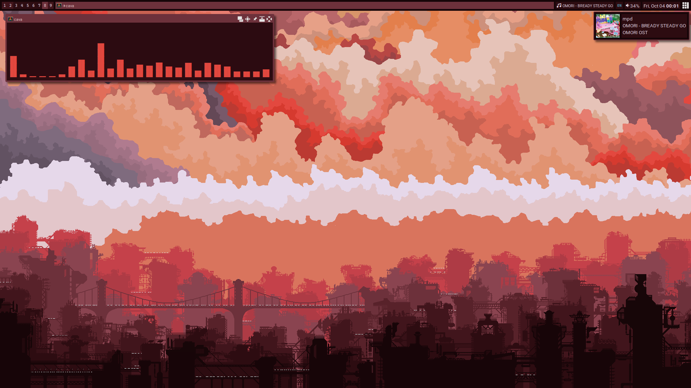

# dotfiles
my .files

## install
- `yay -S awesome-git nemo alacritty maim rofi playerctl picom-git libpulse`
> OPTIONAL: `yay -S ttf-cascadia-code ttf-roboto ttf-nerd-fonts-symbols bibata-cursor-theme`
- `git clone https://github.com/mncc8337/.dotfiles`
- `.dotfiles/tool/create-symlink`
## theme and icon
you can use themix to generate the theme and icon using themix color file `misc/bern`
## notes
- if you are using `scsman`: alacritty, cava and rofi configs are managed by `scsman`, so to modify their config you must modify the files in `.config/scsman/templates`, not those in `.config`
