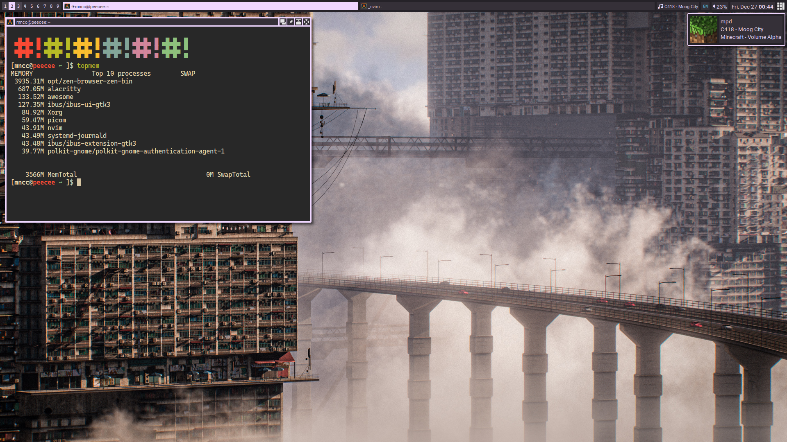

# dotfiles
my .files

## install
> ### NOTE
> - find and replace font name "Caskaydia Cove" or "Roboto" if you wish to use other fonts
> - the commands below only work on arch based system and use yay for pacman wrapper, please check them before running
> - fonts and gtk themes are not included, you need to manualy install them (see optional section)
- `yay -S awesome-git nemo alacritty maim rofi playerctl picom-git libpulse`
- `git clone https://github.com/mncc8337/.dotfiles --recurse-submodules`
- `.dotfiles/tool/create-symlink`
### optional
you may want to use another fonts or theme so this is not mandatory.  
`yay -S ttf-cascadia-code-nerd ttf-roboto bibata-cursor-theme`  
the gtk theme is not included because i use [oomox](https://github.com/themix-project/oomox-gtk-theme) to generate it
