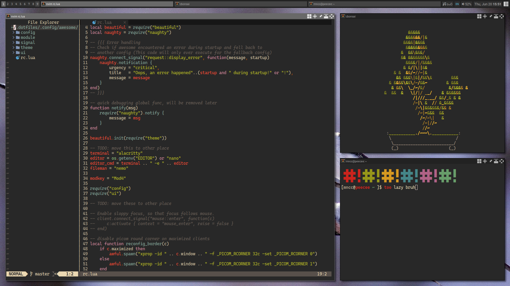

# dotfiles
my .files

## install
- `yay -S awesome-git nemo alacritty maim rofi playerctl picom-git libpulse`
> OPTIONAL: `yay -S ttf-cascadia-mono-nerd ttf-roboto ttf-nerd-fonts-symbols papirus-icon-theme bibata-cursor-theme`
- `git clone https://github.com/mncc8337/.dotfiles`
- `.dotfiles/tool/create-symlink`
